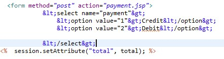
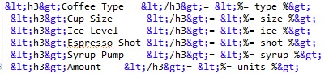

# WebAppSecurity-2nd-Project
# Jazari
Muhammad Akmal Amudi Bin Hassan 1719417

Umar Hakimi Bin Zahabuddin 1714851

Muhammad Nur Afiq Nukman bin Mohd Sazali 1620045

Muhammad Yusuf Bin Zainul Ariffin 1620815

# Coffeeshop

# Introduction
Web applictaion security is implementation security in web application. There are plenty of ways web application could be victimized by the attackers. Prepare the safety situation  before happening is important. The data content in web application so valuable for attacker to harvest.

# Objective
1. For better understanding in web application security.
2. Know which implementation is better for the web application.
3. Understand how the actual code is working.

# Project Scope
Input Validation, Authentication - Afiq Nukman

XSS and CSRF Prevention - Yusuf
A weakness that permits an assailant to add his own content code to a weak web application's page. It utilizes HTML structure rather than URL encryption layer of SSL/TLS to ensure the traffic (HTTPS) diverse with XSS. 
How did XSS occur?
Cross-Site Scripting (XSS) attacks occur when:
1.	Data enters a Web application through an untrusted source, most frequently a web request.
2.	The data is included in dynamic content that is sent to a web user without being validated for malicious content.
Injection is an attacker’s attempt to send data to an application in a way that will change the change the command and follow the new line. For example, the most common example is SQL injection.
How to prevent?
Our defence mechanism to prevent XSS attack is first to encode specific important part of our page which is the payment page  

And also we tried to encode several other part also

 
We also filtered our code with avoiding any <script> tag to sanitize the website and make it safe HTML. We also planned to use HttpOnly attribute to flag cookies but got a few problem with the nginx. 
CSRF prevention.
We are implementing reauthenticate measure for another session that the user want to use, like maybank apps.Preventing XSS attack is also a good measure to prevent CSRF attack.

Database Security Principles - Umar Hakimi

  For the database security principle, the prevention that I used to tighten the database security is preventing a SQL Injection. From my understanding from this course is that one way of a SQL injection was done is through a user/attacker entering an input that contains a script which mimics the query statement of the database to manipulate the database. For example, the attacker can enter “Delete userID from Table;”  as username login and those strings will execute that SQL command. For this, I’ve placed patterns for inputs to avoid any SQL command to be executed. For example, for the username, the pattern required the username to not include any special character except ’space’, which most SQL commands need the “ ; ” for them to be executed.  

  As for the database server, I enhance it with stored procedure. This is to ensure that the data that was called were coming from  the procedure instead of the database itself. This can help me secure the properties of the database to avoid the attacker knowing the name where each data stored. Through this method, I also can avoid sql injection and Insecure Direct Object Reference due to different names for data request and the real database.

Authorization, File Security Principle - Akmal Amudi
In Authorization, we make separated role for sepaeated duties. For user, they only can view from user side and admin side, they only can view from administration side. By doing this, we manage to do mappling application roles to application server groups. Map the role of user login defined in the application to the group of user defined on the Application Server by adding a security-role-mapping element to the sun-web.xml runtime deployment descriptor file. We create another xml file mapping with user login page.

For File Security Principle,
To prevent from file leaks, using doPost to pass sensitive data or to protect it.
We hardening our web server by configure Tomcat to support SSL or https. This could to help to reduce attack on the server. Setting started from command prompt.
